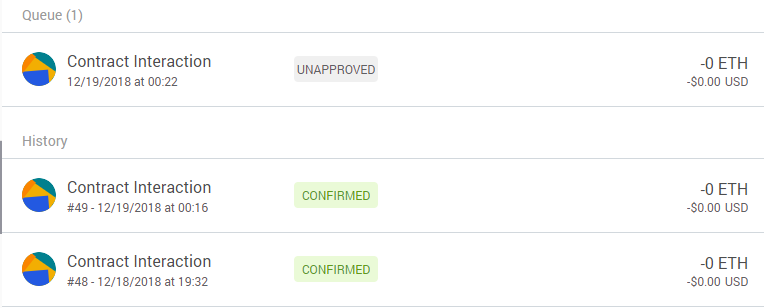
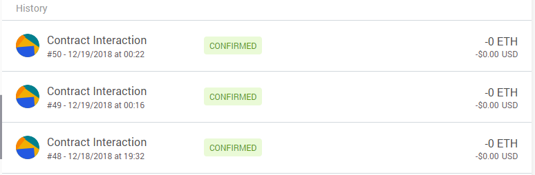

# 使用 Truffle 开发并部署一个旅游景点点评的 Dapp

## 选题背景，依据

### 背景

最近， 国内知名旅游攻略网站马蜂窝被曝光评论抄袭造假。事实上，几乎所有互联网企业的点评系统， 如携程、去哪儿网、美团等， 都存在大量的虚假信息，使用户在旅游之前无法获取真实准确的信息，误导用户的选择。
这些平台存在的问题：

1. 这些点评系统都是中心化平台，中心机构能随意修改数据和信息；
2. 账户申请成本低， 平台中有大量水军发布虚假评论，刷好评或恶意评论；
3. 评论真实性无法确认，存在信任问题。

### 依据

区块链具有去中心化，可信任，不可篡改等特性，将点评系统迁移到区块链上，可以很好地解决上述问题。实现一个旅游景点点评的 Dapp 并部署到区块链上，用户可以对自己去过的景点，住过的酒店等进行点评， 系统会和用户身份信息进行匹配验证， 保证每一条评论的真实性。 这些评论被打包进区块并发布到区块链网络上，经区块链节点验证成功后，该评论信息便无法篡改。因此，在区块链中，可以实现一个真实可信，公开透明的点评系统。

## 使用说明

### 环境搭建

1. 安装 Node.js: [Link](https://nodejs.org/en/download/)
2. 安装 Truffle: `npm install -g truffle`
3. 安装 Ganache: [Link](http://truffleframework.com/ganache/)

### Truffle 项目目录结构

 - `contracts/` 智能合约的文件夹，所有的智能合约文件都放置在这里
 - `migrations/` 用来处理部署（迁移）智能合约 ，迁移是一个额外特别的合约用来保存合约的变化。
 - `test/` 智能合约测试用例文件夹
 - `truffle.js` 配置文件

### 编译

在 Dapp 的根目录 comment-scenic-spots 下

```
truffle compile
```


### 部署

在执行部署之前，需要确保有一条区块链在运行，可以使用 Ganache 来开启一条私链来进行测试


修改 `truffle.js`, 连接到测试链上，然后执行部署命令

```
truffle migrate
```


在 Ganache 里可以看到区块链状态发生变化，产生了4个区块


### 在浏览器中进行

 - 为合约编写 UI: 套用了 Truffle Box `pet-shop` 应用的前端代码，代码在 `src/` 文件夹下。
 - 创建用户接口和智能合约交互，让合约可以真正用起来
 - 安装 MetaMask, 配置个人钱包，并连接到开发区块链网络，添加一个私链中的账户


 - 接下来需要本地的 web 服务器提供服务的访问， Truffle Box `pet-shop` 里提供了一个 lite-server 服务可以直接使用。运行 `npm run dev` 即可启动 lite-server, 会自动打开浏览器显示 Dapp


## 测试

### 测试智能合约

在 test 目录下新建并编写测试用例，`truffle test` 运行测试用例


合约测试通过

### 测试 Dapp

输入评分，点击 comment 按钮，Dapp 便会发送交易到用户以太坊账户。


此时账户中增加了一条待确认的交易




用户可以确认交易或拒绝交易，确认交易后，该交易稍后会被打包进区块链，用户无法再对其进行篡改。



查看交易详情


## 改进和完善

由于时间受限和 solidity 语言尚不熟悉，本项目的 Dapp 只实现了简单的逻辑和与智能合约的交互，下面给出一些改进和完善的 idea，之后再继续探索。

 - 将评分和评论信息（字符串）添加到交易中
 - 记录每个景点被点评的次数，计算历史评分平均值作为该景点目前的评分
 - Dapp 能从区块链中查询和获取用户的评论信息并显示
 - 每个用户能多次评论，但计算评分是只考虑最近一次的评分


## 参考资料

 - truffle 框架文档：http://truffle.tryblockchain.org/
 - solidity 文档：https://solidity-cn.readthedocs.io/zh/develop/
 - 【深入浅出区块链】博客：https://learnblockchain.cn/
